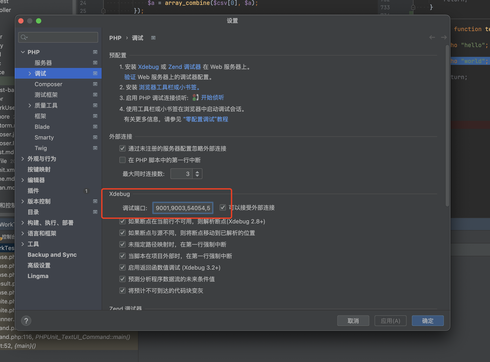
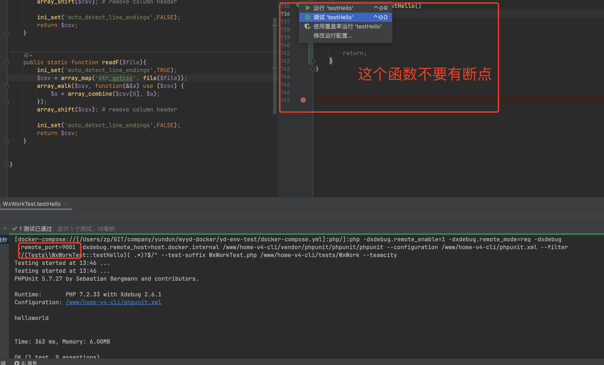

# xdebug


## 1. 配置 xdebug

```ini
; ----------
; 2025-08-17 13:29:41 可以修改 端口, 需要同步修改 phpstorm 调试里面的端口(默认使用第一个端口, 多个逗号分割)

; [xdebug]

; zend_extension="xdebug.so"
; xdebug.idekey="PHPSTORM"

; xdebug.remote_enable = 1
; xdebug.remote_mode = req
; xdebug.remote_port = 9001
; xdebug.remote_host = host.docker.internal
; xdebug.remote_handler = "dbgp"
; xdebug.remote_autostart = 1
;
; ------------  end


[xdebug]

zend_extension="xdebug.so"
; zend_extension=/usr/local/lib/php/pecl/20170718/xdebug.so
xdebug.mode = debug
xdebug.idekey="PHPSTORM"

; xdebug.remote_enable = 1
xdebug.remote_port= 9001
; xdebug.remote_host=127.0.0.1
; xdebug.remote_handler = "dbgp"
; xdebug.remote_connect_back=1
; xdebug.scream=0
; xdebug.show_local_vars=1
; xdebug.idekey=PHPSTORM
; xdebug.remote_enable=On
; xdebug.remote_autostart=On
xdebug.start_with_request=yes
; xdebug.client_host=host.docker.internal

# # update: 2023-12-24 15:19:17
# # xdebug.remote_port= 63715
# xdebug.remote_host = docker.for.mac.localhost


# # update  2023-12-24 16:10:00 
# zend_extension = xdebug
# xdebug.mode = debug
# xdebug.start_with_request = yes
# xdebug.client_port = 9003
# xdebug.discover_client_host = true
# xdebug.client_host = docker.for.mac.localhost
# xdebug.remote_host = docker.for.mac.localhost


# docker 环境配置
# xdebug.mode = debug
# xdebug.client_host=docker.for.mac.localhost


```

其实只需要这部分即可

```ini
[xdebug]

zend_extension="xdebug.so"
xdebug.idekey="PHPSTORM"

xdebug.remote_enable = 1
xdebug.remote_mode = req
xdebug.remote_port = 9001
xdebug.remote_host = host.docker.internal
xdebug.remote_handler = "dbgp"
xdebug.remote_autostart = 1
```


## 2. 配置 phpstorm

**主要是第一个端口**



